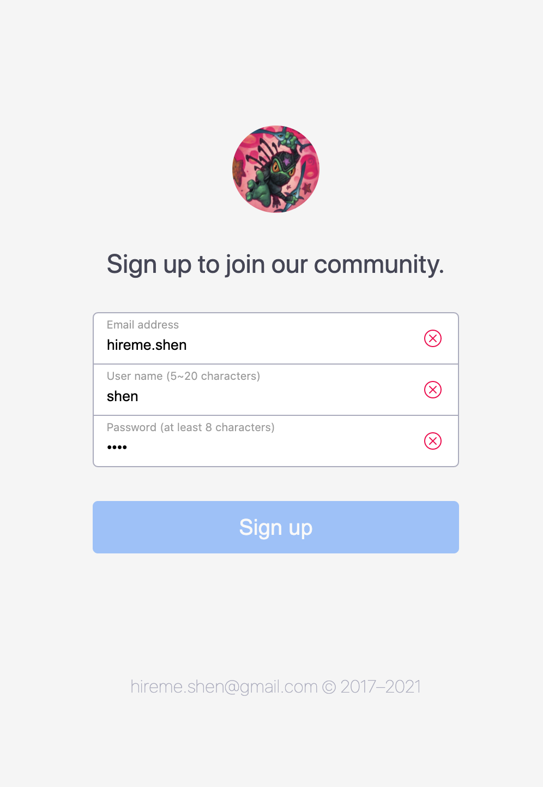
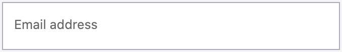
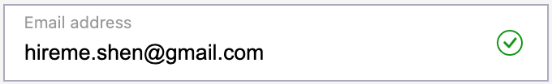
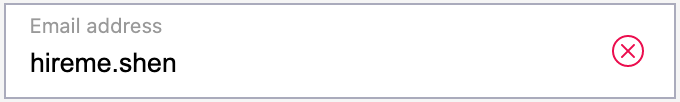

# form-validation
     


A light-weight reusable floating label form with validation.
Online preview: <a href="http://www.ciaoshen.com/js-form-validation/">ciaoshen.com/js-form-validation</a>

  


## Download
Download the release `form-validation-v1.0` package. Unzip the package you will have a folder structured as below. 
```
.
├── LICENSE
├── README.md
├── assets
│   └── img
│       ├── check-circle-green.svg
│       ├── logo.png
│       └── x-circle-red.svg
├── css
│   ├── form-validation.css
│   └── sign-up.css
├── sign-up.html
└── js
    ├── form-validation.js
    └── sign-up.js
```


## Use directly the demo sign-up page
To use directly the `sign-up.html` as your sign up page, or to customize your personal version based on it, the following files are **required**.
```
.
├── sign-up.html
├── assets
│   └── img
│       ├── check-circle-green.svg
│       └── x-circle-red.svg
├── css
│   ├── form-validation.css
│   └── sign-up.css
└── js
    ├── form-validation.js
    └── sign-up.js
```


## Use only the form-validation unit
You can also use a single styled `form-validation` form alone whereever you want. 





First, in the HTML page,
1. Add a class `class="form-control"` to your `<input>` element.
2. Wrap the `<input>` element with a `<div>` container, then add 2 classes: `class="form-floating form-validation"`.

The following code is an simple example,
```html
<div class="form-floating form-validation email">
    <input type="email" class="form-control" name="email" id="email">
    <label for="email">Email address</label>
</div>
```

Then include `form-validation.css` into your own CSS file as follow,
```css
@import url(./form-validation.css);
```

At last include the `form-validation.js` into your Javascript file. Create a pattern, call `formValidation.bindPattern()` API to bind it to your own form element. The following code is a simple example.
```js
import { formValidation } from "./form-validation.js";

/* email form element */
const emailForm = document.querySelector('.form-validation.email');
/* email pattern */
const emailPattern = /^[\w\.-]+@[\w-]+\.[\w-]{2,}$/g;
/* bind pattern to the form */
formValidation.bindPattern(emailForm, patterns.emailPattern);
```

Make sure that the svg icon files `check-circle-green.svg` and `x-circle-red.svg` are under `./assets/img/` direction.

Happy coding!